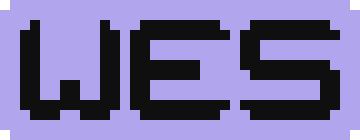

<div align="center">
<h1>The Wes Programming Language<br><small>-= WesProL =-</small></h1>

<div>


[](../../raw/main/LICENSE.txt)


</div>
</div>

A **highly inefficient**, very **experimental**, and **absolutely explicit** compiled
general purpose language that is adequately comfortable to write.

It features manual memory management and inherently UTF-8 safe strings.

> The book [Writing An Interpreter In Go](https://interpreterbook.com/) got me started. Highly recommend it!

## What is WesProL?

An amalgamation of Go, Rust, C#, JS, and PHP syntax, maybe some Zig added for flavour.

This ~~is~~ will be a compiler targeting C as its back-end.
The bootstrapping process will be done entirely in PHP, for personal reasons.
Once v0.0.1 is fully operable, this entire repository will be rewritten in WesProL (with some C interop).

WesProL is intended to be a compiled general purpose language.
It will feature a vast standard library, hopefully as great as Go, including HTTP server capabilities.
It also will feature interoperability with C (mostly for reliance on established C libraries to get started).

## How do I run this?

You don't. Not yet.

You can run the [hand compiled examples](./c_manually_compiled_examples) to see that the resulting C works.
So far no process exists to automatically generate C from WesProL source.

## Why create another pointless imperative/object-oriented language?

This will be the first proper compiler I will have ever written.

I have not spent much time with functional languages, that's why this isn't one.

It is mostly an exercise, although I intend to use this in personal projects to
prove real world application and improve the language and standard library.

## Is this a pointless waste of time?

This language does not fill any niche, it does not satisfy an active need for "something new",
it will probably die with me once my own clock runs out, but why would that stop me?

I intend to conquer the concept of writing interpreters and compilers,
first with this, next maybe with something else entirely.

## Use cases

For now and probably the near future I don't think anyone should use this.
Actually: **Please** don't use this in production code. Use:

- C, C++, Rust, Zig or Odin for your system programming
- Use Go, PHP, JS, etc. for your webservices
- Or just use any other language you are comfortable with

## The elephpant in the room

Yes, bootstrapping will be done entirely in PHP.

Why? Because that's the language I feel most comfortable writing.
I have spent (as of writing) 6 years with this language
and would consider myself quite competent with PHP.

Since this is a throwaway product, why bother writing it in Rust, OCaml or Go?
Just use the thing you know best to get the job done.
It's only for bootstrapping after all.

## I want to support and contribute to this project...

No you don't!

I know I'm likely talking to no one here.
But since it will be open source, someone might decide to help out.
Maybe some day, in a few years. Until then this is just for my personal learning.

## Data types

- `bool` is a C `bool`
- `byte` is a C `unsigned char`
- `int` is a C `long`
- `float` is a C `double`
- `char` is a custom UTF-8 character (5 bytes, yep)
- `string` is a custom string of (not C) `char`
- `array` is essentially a map with array capabilities, just like PHP's `array`
- `error` is a **caught** error message consisting of
  - message `string`
  - file `string`
  - line `int`
  - column `int`
  - trace `array[array{line: int, column: int, class: string, function: string, args: array[?]}]`
  - previous `error|null`
- Object is any form of object
  - an instance of a `class`
  - ranges created by the `..` or `..=` syntax are instances of `\Standard\Range`
- `type` represents any of the above types

## Special types

### `never`

- `never` is not a data type, you cannot ever store `never`
- it is a method return type similar to `void`, not returning anything
- it forces a method marked as returning `never` to
  - either directly call to `\Standard\Process::exit()` which also returns `never`
  - or call another method with return type `never`
  - 
- a call to a method with return type `never` does not necessary make the calling method require returning `never`
  - only if a method **always** ends execution by **always** calling a method with return type `never` (like `Process::exit()`) should you use `never`
- `Program::main()` **SHOULD NOT** be written with the return type `never` (it should always be `void`)
  - since the end of `main()` only implicitly stops the program
  - and `never` is for **explicit** code stops
  - which aids any potential IDE in detecting dead code
- methods with irrecoverable permanent loops **SHOULD** return `never` to signify no other code will ever run after it
  - those methods are required to catch all runtime errors inside the loop

> It is basically the PHP never type.

> /!\ **This will be used but not enforced during the initial phase of this compiler.**
> 
> Implementing this ruleset requires extensive "linting" and will be implemented eventually.

### Stack And Heap

`int`, `float`, `bool`, `char`, `type`: **always** live on the stack.

`byte` also lives on the stack, you should only handle bytes with streams!

`string`, `array`, `error`, Object: **always** live on the heap
and need to be manually freed with the `delete` keyword.

Simple rules, no boxing and unboxing, no nothing.

### ByRef and ByVal

All types are passed by value by default.

Strings will be automatically cloned before being
passed to a new variable or a function.
Similarly, arrays will be recursively cloned.
Objects are expensively cloned recursively on every pass.

To improve performance, explicit passing by reference should be used where adequate.

References need to be explicitly dereferenced.

References themselves do not need to be freed as they live on the stack.
Only the non-scalar value inside the reference needs manual cleanup.

## Examples

> The provided examples may change at any point in time.
> In fact, they already have changed several times.
> Those are just ideas for now.

### Hello World!

```php
namespace \App;

use \Standard\Format;

class Program {
    public static function main() void {
        // Format is a class, println is a static method
        Format::println("Hello World!");
    }
}
```

### Fib

```php
namespace \App;

use \Standard\Format;

class Program {
    // return fibonacci at the nth position
    private static function fib(n int) int {
        if n <= 1 {
            return n;
        }

        return self::fib(n - 1) + self::fib(n - 2);
    }

    public static function main() void {
        let fib47 int = self::fib(47);
        Std::Format::println("{}".format(fib47)); // should print "2971215073""
    }
}
```

### FizzBuzz

```php
namespace \App;

use \Standard\Format;

class Program {
    // Note, this leaks memory by design, strings are never cleaned up.
    // That is fine for short-lived example processes though.
    public static function main() void {
        // Rust style ranges, need to be int, cannot use float
        for i in 1..=100 {
            Format::println(
                // if is an expression! not a statement
                if i % 15 {
                    give "FizzBuzz";
                } elseif i % 3) {
                    give "Fizz";
                } elseif i % 5 {
                    give "Buzz";
                } else {
                    give i.toString();
                },
            );
        }
    }
}
```

### All the loops

```php
namespace \App;

class Program {
    public static function main() void {
        // runs forever, until broken or returned
        loop {
        
        }

        // exclusive range 0..10, 0 to including 9
        for i in 0..10 {

        }

        // classic while
        while condition == true {

        }

        // classic do while
        do {
        
        } while condition == true;
    }
}
```

### Guess a number

```php
namespace \App;

use \Standard\Format;
use \Standard\Random;
use \Standard\Compare;
use \Standard\Ordering;

class Program {
    public static function main() void {
        let number int = Random::range(1..100);
        let guess int = 0;

        do {
            Format::print("Enter your guess: ");
            guess = Format::readLine().trim().toInt();

            // you can taste the Rust
            match Compare::compare(guess, number) {
                // Ordering is an enum
                Ordering::Less => Format::println("Your guess is too small!"), 
                Ordering::Greater => Format::println("Your guess is too large!"), 
            };
        } while guess != number;

        Format::println("You guessed correctly, it was {}!".format(number));
    }
}
```

### Typecasting

```php
namespace \App;

use \Standard\Format;

class Program {
    public static function main() void {
        let foo int = 1234;
        // no (cast) shenanigans, we just have conversion methods
        let bar float = foo.toFloat();

        // strings need to be cleaned up to not leak memory
        let str string = bar.toString();
        Format::println(str);
        // cleans up the string
        delete str;
    }
}
```

### Multipropsetting which I wished PHP had and kickstarted this entire project

```php
namespace \App;

use \Standard\Format;

class Program {
    public static function main() void {
        let myObject MyClass = new MyClass();
        
        // what PHP couldn't give us
        myObject.{
            foo = 13,
            bar = 37,
        }.doSomething();

        // this is equivalent to
        myObject.foo = 13;
        myObject.bar = 37;
        myObject.doSomething();

        Format::println("{}{}".format(myObject.foo, myObject.bar));

        delete myObject;

        // can be easily used as initializer, returns the object instance
        let otherObject OtherClass = new OtherClass().{fooBar = 1337};
        let leet string = otherObject.toString();

        delete otherObject;    

        Format::println(leet);
        
        delete leet;
    }
}
```

### Interfaces, Stringable, Constructor

```php
namespace \App;

class Foo : Stringable {
    private a int;
    private b int;
    public c int = 3;
    
    public Foo(a int, b int = 2) {
        this.a = a;
        this.b = b;
    }

    public function toString() string {
        return "A: {}\nB: {}\nC: {}".format(this.a, this.b, this.c);
    }
}
```

```php
let myObj Foo = new Foo(1).{c = 4};

Format::println(myObj.toString());
// A: 1
// B: 2
// C: 4
```

### Union Types

```php
namespace \App;

use \Standard\Format;
use \Standard\Types;

class Dumper {
    public static function dump(
        data int|float|string|Stringable|null,
    ) string {
        Format::println(self::getValue(data));
    }
    
    private static function getValue(data int|float|string|Stringable|null) string {
        if data == null {
            return "NULL";
        }
    
        let typeString string = Types::getType(data).toString();
        let dataString string = data.toString();
        defer {
            delete typeString;
            delete dataString;
        };
        return "{}({})".format(typeString, dataString);
    }
}
```

```php
Dumper::printDump(1);       // int(1)
Dumper::printDump(13.37);   // float(13.37)
Dumper::printDump("Hello"); // string(Hello)
Dumper::printDump(null);    // NULL
```

### Union static checking

The compiler will enforce strict typing.
A value of `string|int|null` cannot be passed to a method expecting `int`
without previous assertions about the type as that would cause
undefined behaviour.

[//]: # (TODO: implement this once bootstrapping is done, until then we will ride this train unsafely)

```php
let value string|int|null = ValueGenerator::something();

// THIS WILL NOT COMPILE:
// value = MyCustomMathClass::add(value, 123);

if value === null {
    return;
}

// compiler now knows value may only be string|int

if value instanceof string {
    return;
}

// compiler now knows value may only be int

value = MyCustomMathClass::add(value, 123);
```

### Array Types (includes Maps, just like PHP but with _more_ syntax)

```php
namespace \App;

class Foo {
    public function test(
        // Go equivalent: []string
        myStringArray array[string],
        // Go equivalent: map[string]int
        myStringIntMap array[string -> int],
        // Go equivalent: map[string][]int
        mapCouldHaveStringsOrArraysOfInts array[string|array[int]],
        // Go equivalent: NONE
        arrayWithKnownKeys array{id: int, uuid: string},
        // Go equivalent: NONE ([string|int|float KEY] map[KEY]any)
        arbitraryArrayMustBeExplicit array[?],
    ) string {
        // ...
    }
}
```

### Array usage

```php
public static function main() void {
    let foo array[int] = array(10); // bucket-capacity¹
    foo["a"] = 1300;
    foo[0] = 37;

    // append
    foo[] = 123;
    
    let bar array[string] = [
        "123",
        "456",
        "789",
    ];
    
    // this lets you modify a value via variable
    // but more importantly this prevents copying
    // which can be very important for large values like objects!
    let bar1Ref = bar&[1];
    *bar1Ref = "000";
    // bar now is ["123", "000", "789"]

    Format::println(
        "{} {} {} {}".format(
            foo["a"] + foo[0],
            foo[1],
            foo.capacity,
            foo.length,
        ),
    );
}
```

¹ Increased bucket capacity may significantly increase performance
at the cost of slight memory usage overhead as the collision handling
implementation uses linked lists on collision which is slower than direct access.

### We don't want classic inheritance!

There is no `extends` keyword.
There also is no single- or multi-inheritance.

We just have classes with traits.

```php
namespace \App;

trait User {
    public id int;
    public username string; 
}
```

```php
namespace \App;

class Administrator {
    use User;

    public function doSomethingAdministrative() void {}
}
```

```php
namespace \App;

class User {
    use User;
}
```

```php
public function getUserId(user User) int {
    return user.id;
}
```

```php
public function isAdministrator(user User) bool {
    return user instanceof Administrator;
}
```

### Trait conflicts

```php
namespace \App;

use \Standard\Process;

trait LogTrait {
    protected function log(message string) void {
        // do the logging to file
    }
    
    protected function fatal(message string) never {
        this.log(message);
        Process::exit(1);
    }
}
```

```php
namespace \App;

use \Standard\Format;
use \Standard\Process;

trait FatalTrait {
    protected function fatal(message string) never {
        Format::println(message);
        Process:exit(1);
    }
}
```

```php
namespace \App;

class FooService {
    use LoggerTrait { log }, FatalTrait;
    
    public function whatever() {
        this.log("Test"); // LoggerTrait
        this.fatal("OH NO!"); // FatalTrait
    }
}
```

### Error handling

Errors are basically interfaces.

They always only have one attached value, a message `string`.

> I mostly came up with the syntax on my own and after the fact realized it is quite similar to Zig.
> After taking a look at Zig, I streamlined the syntax to look saner.

```php
namespace \App\Error;

error AppError;
```

```php
namespace \App\Error;

use \Standard\Error\InvalidArgumentError;

error AppInvalidArgumentError : AppError, InvalidArgumentError;
```

```php
namespace \App\Error;

error AppSomethingIsNotRightError : AppError;
```

```php
namespace \App;

use \Standard\Format;
use \Standard\Process;

class Program {
    // ! indicated this may return an error
    private static function doSomethingRisky() !void {
        throw AppSomethingIsNotRightError "You done goofed up.";
    }
    
    // this has to still be explicitly !void
    // since it doesn't intercept nested errors
    // compiler will (at some point) enforce that
    private static function mightDoSomethingRisky() !void {
        this.doSomethingRisky();
    }

    public static function main() void {
        mightDoSomethingRisky() catch err {
            AppError => {
                Format::println(err.toString());
                Process::exit(1);
            },
        };
    }
}
```

### Deferring

Taken right out of the Go cookbook.

```php
public function foo() !void {
    let bar string = "Abc 123";
    // bar will be automatically cleaned up no matter what
    defer { delete bar; };
    
    this.doSomethingRiskyWithString(bar);
}
```

### String memory leaks

```php
public function foo() void {
    // this doesnt leak memory
    let fmt string = "Foo: {}";
    Format::println(fmt.format(1337));
    delete fmt;
    
    // this would leak memory, if it were just a string, but it's a string-literal!
    // they get automatically cleaned up once out of scope
    // string variable assignments clone literals to gain ownership, which probably eats performance
    // I desperately need to remember to implement it this way!
    Format::println("Foo: {}".format(1337));
}
```

### C interop

`$PROJECT_DIR$/wesprol.toml`
```toml
[project]
# TODO

[project.source]
namspace="App"
directory="src"

[project.interop]
load="./c/load.h"
```

`$PROJECT_DIR$/c/load.h`
```c
#include "libs/leet.h"
```

`$PROJECT_DIR$/c/libs/leet.h`
```c
double leet(long x, double y) {
    return (double)x + y;
}
```

Identifiers starting with `$` are called "Lexer Directives".

A thing I just came up with after 4 days of trying to create an interop syntax.

They completely change the behaviour of the lexer until the end-sequence `$end` is encountered¹.

¹ "encountering" really depends on the individual lexer directive,
as the `$run` directive has C-string, C-char, and comment aware parsing and
won't "encounter" `$end` inside string-/char-literals and comments.

`$PROJECT_DIR$/src/Program.wes`
```php
namespace \App;

use \Standard\Format;

class Program {
    public static function main() void {
        let foo int = 13;
        let bar float = 0.37;

        $pass foo as a, bar as b $end
        $run
            double result = leet(a, b);
        $end
    
        let result float = $get result as float $end;
        Format::println(result.toString());
    }
}
```

### References

> IMPORTANT: The WesProL dereference operator `*` has higher binding power than C.
> 
> It always dereferences the variable next to it.
> 
> `*foo.*bar` is equivalent to C `*((*foo).bar)`!
> 
> Similarly, the reference operator `&` differs from C in terms of syntax.
> 
> `user.&name` is the syntax to access a property reference.
> It is equivalent to C `&(user.name)`.

```php
public static function main() void {
    let foo int = 100;
    let bar int = foo;
    let fooref &int = &foo;

    bar += 1;
    *fooref += 2;

    Format::print("Foo: {}\nBar: {}\nFooRef: {}\n".format(foo, bar, *fooref));
}
```

```shell
Foo: 102
Bar: 101
FooRef: 102
```

This example shows a `&User` having a `&Group` that also has `array<&User>`.

```php
public static function main() void {
    let user &User = UserRepository::findUserById(123);
    let admin &User|null = null;

    // equivalent to C user->group->users
    // or C *(*(*user).group).users
    for userInGroup in *user.*group.*users {
        if *userInGroup.administrator == true {
            admin = userInGroup;
            break;
        }
    }
    
    if admin == null {
        Format::println("No administrator found!");
    
        return;
    }
    
    Format::println("Administrator: {}".format(*admin.name));
}
```

### NULL-safety

```php
let foo string = Whatever::generateStringOrNull() ?? "default";
let username string|null = UserRepository::findById(123)?.username;
```

### Enumerations

> There are no backed enums like PHP, just `int`.

```enum
enum TokenType {
    Illegal,
    Eof,
    Identifier,
    Integer,
    Decimal,
    // ...
}
```

```php
let tokenType TokenType = TokenType::Identifier;
```

### match expressions

> Missing `default` branch will result in a NULL-Value on runtime
> and may cause unexpected behaviour or crashes if the type does not accept `null`.
>
> Always complete your matches or ensure matched null value is accepted as `null`.

#### match value expressions

> `match` expressions may mix between code and value syntax.
> The resulting C code will always use a code syntax equivalent for value branches.

```php
let test int|string|null = match val {
    "test" => 1,
    "foo", "bar", "foobar" => 2,
    "thingy" => "stringy",
    default => null,
};
```

The following result is not optimized at all, it doesn't use any proper lookup. That is fine for now.

#### match code expression

> Omitting `give` results in `null` being the given value of the branch.

```php
let result int = match val {
    0 => {
        give A::do(val);
    },
    1, 2 => {
        give B::do(1);
    },
    3, 4, 5 => {
        C::do(val);
        give D::do();
    },
};
```

#### match mixed expression

[//]: # (TODO)

## Planned features is future releases

- named arguments
- ...
